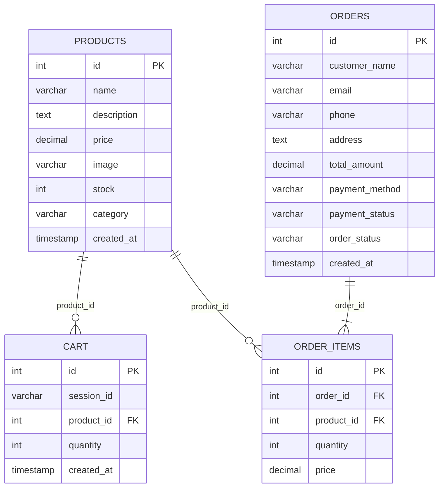

# 🛒 Online Shopping Cart Web Application

A full-stack, responsive **Online Shopping Cart** web application developed as a college project for the Database Management Systems (DBMS) course. Built with **Python Flask**, **MySQL**, **Jinja2**, **HTML5**, and modern **CSS3**.

---

## 📌 Table of Contents

1. [Project Overview](#-project-overview)
2. [Key Features](#-key-features)
3. [Technologies Used](#-technologies-used)
4. [Database Structure](#-database-structure)
5. [Folder Structure](#-folder-structure)
6. [Installation & Setup](#-installation--setup)
   - [Prerequisites](#prerequisites)
   - [1. Clone / Open Repository](#1-clone--open-repository)
   - [2. Install Python Dependencies](#2-install-python-dependencies)
   - [3. MySQL Database Setup](#3-mysql-database-setup)
   - [4. Configure Database Credentials](#4-configure-database-credentials)
7. [Running the Application](#-running-the-application)
8. [Application Flow & Routes](#-application-flow--routes)
9. [Screenshots Placeholder](#-screenshots)
10. [Security & Validation](#-security--validation)
11. [Future Improvements](#-future-improvements)

---

## 📖 Project Overview

**ShopCart** is an intuitive e-commerce web platform where users can:
- Explore a catalog of products categorized into Audio, Wearables, Electronics, Home, and Accessories.
- Search for products in real-time or filter by category.
- View live inventory stock status (In Stock, Low Stock, or Sold Out).
- Add products to a shopping cart, update item quantities, and remove unwanted items.
- Proceed through a multi-step checkout workflow with customer validation.
- Complete an interactive **Demo Payment** (supporting Cash on Delivery, UPI QR code, and Credit/Debit card simulators).
- Receive instant digital order receipts and browse historical orders with status tracking.

---

## ✨ Key Features

- **Product Catalog & Dynamic Search:** Instant title & description keyword search with category filtering pills.
- **Stock Validation:** Prevents adding more items than available in inventory; automatically tracks stock decrements on purchase.
- **Isolated User Carts:** Session-based UUID tracking allows multiple concurrent visitors to maintain independent carts without mandatory account creation.
- **Full Cart Management:** Real-time subtotal calculation, quantity steppers, item removal, and empty-cart indicators.
- **Multi-Step Checkout Flow:**
  - Step 1: Customer Contact & Shipping Details with form validation.
  - Step 2: Realistic Demo Payment Gateway (COD, UPI, Card).
  - Step 3: Verified Order Confirmation & Digital Receipt.
- **Comprehensive Order Tracking:** Order history dashboard displaying order ID, timestamp, items purchased, total amount, payment status, and fulfillment state.
- **Modern Responsive Design:** Glassmorphic navigation bar, interactive hover states, badge counters, mobile hamburger drawer, and clean Google Fonts typography (`Inter` & `Outfit`).

---

## 🛠 Technologies Used

| Layer | Technology | Description |
| :--- | :--- | :--- |
| **Backend** | Python 3.x, Flask | Lightweight WSGI web framework and routing |
| **Database** | MySQL 8.0 / 5.7 | Relational Database Management System |
| **DB Connector** | PyMySQL, MySQL-Connector | Fast, pure-Python MySQL client with dictionary cursor support |
| **Frontend** | HTML5, CSS3, JavaScript | Modern, vanilla responsive interface (No bulky JS frameworks) |
| **Templating**| Jinja2 | Dynamic HTML templating integrated with Flask |
| **Icons & Fonts**| Font Awesome 6, Google Fonts | Outfit and Inter web typography |

---

## 🗄 Database Structure

The database `online_shopping_cart` consists of 4 normalized relational tables with primary keys and cascading foreign keys:



### Table Details:
1. **`products`**: Catalog items, pricing, inventory stock, images, and category taxonomy.
2. **`cart`**: Current active shopping cart lines tied to visitor `session_id`.
3. **`orders`**: Customer shipping information, total order price, payment mode, and fulfillment status.
4. **`order_items`**: Individual line items purchased per order, preserving unit price at purchase time.

---

## 📁 Folder Structure

```
online-shopping-cart/
│
├── app.py                     # Main Flask backend application & route handlers
├── database.sql               # MySQL database schema and 12 sample seed products
├── requirements.txt           # Python dependencies list
├── README.md                  # Complete project documentation & guide
│
├── templates/                 # Jinja2 HTML templates
│   ├── index.html             # Storefront catalog, hero banner, search & filters
│   ├── cart.html              # Shopping cart view, quantity updater, subtotal
│   ├── checkout.html          # Shipping address & customer information form
│   ├── payment.html           # Demo payment gateway (COD, UPI, Card simulation)
│   ├── success.html           # Order confirmation, invoice summary & receipt
│   └── orders.html            # Previous orders dashboard and tracking
│
└── static/                    # Static frontend assets
    └── css/
        └── style.css          # Unified modern responsive stylesheet
```

---

## 🚀 Installation & Setup

### Prerequisites
- **Python 3.8+** installed ([python.org](https://www.python.org/downloads/))
- **MySQL Server 8.0 or 5.7** (or XAMPP / WAMP / MySQL Workbench) installed and running.

---

### 1. Clone / Open Repository
Open your terminal or command prompt in the project root directory:
```bash
cd "d:\Muneeb S.B.Jain\5th SEM\DBMS\online-shopping-cart"
```

---

### 2. Install Python Dependencies
Install all required libraries using `pip`:
```bash
pip install -r requirements.txt
```

---

### 3. MySQL Database Setup

#### Option A: Using MySQL Command Line Client
Log into MySQL and execute the `database.sql` script:
```bash
mysql -u root -p < database.sql
```
*(Enter your MySQL password when prompted).*

#### Option B: Using MySQL Workbench or phpMyAdmin
1. Open MySQL Workbench or phpMyAdmin.
2. Open the file `database.sql`.
3. Execute the entire SQL script.
4. Verify that the `online_shopping_cart` database and 4 tables (`products`, `cart`, `orders`, `order_items`) have been created with 12 seeded products.

> **Note:** The application also features an automatic database bootstrapper in `app.py` that will attempt to automatically create and seed the database if it detects the table is not yet present on startup.

---

### 4. Configure Database Credentials
Open `app.py` in your text editor. At the very top of `app.py`, update your MySQL server credentials:

```python
# ==============================================================================
# DATABASE CONFIGURATION
# Update the variables below with your MySQL server credentials.
# Default root password is often empty '' or '1234' or 'root' depending on your setup.
# ==============================================================================
DB_HOST = os.environ.get('DB_HOST', 'localhost')
DB_USER = os.environ.get('DB_USER', 'root')
DB_PASSWORD = os.environ.get('DB_PASSWORD', '1234')  # <-- ENTER YOUR MYSQL PASSWORD HERE
DB_NAME = os.environ.get('DB_NAME', 'online_shopping_cart')
DB_PORT = int(os.environ.get('DB_PORT', 3306))
```

---

## 💻 Running the Application

Start the Flask development server:
```bash
python app.py
```

You will see output similar to:
```
Database initialized successfully from database.sql.
 * Running ShopCart application on http://127.0.0.1:5000
 * Debug mode: on
```

Now open your web browser and navigate to:
👉 **`http://127.0.0.1:5000`** (or `http://localhost:5000`)

---

## 🔄 Application Flow & Routes

| Route | Method | Description |
| :--- | :---: | :--- |
| `/` | `GET` | Catalog home page: view products, search, filter by category |
| `/cart` | `GET` | View current shopping cart items, update quantities, calculate grand total |
| `/add-to-cart/<id>` | `POST` | Add product to cart; checks available warehouse inventory stock |
| `/update-cart/<id>` | `POST` | Modify item quantity in cart; deletes item if quantity <= 0 |
| `/remove-from-cart/<id>` | `GET/POST` | Remove specific product from cart |
| `/checkout` | `GET/POST` | Validate shipping & contact information; review total price |
| `/payment` | `GET/POST` | Simulated demo payment portal (COD, UPI, Card); creates order and decrements stock |
| `/success` | `GET` | Displays order confirmation receipt and transaction breakdown |
| `/orders` | `GET` | Dashboard of all customer orders, statuses, dates, and line items |

---

## 📸 Screenshots

*(Place screenshots of your project demonstration here)*

1. **Home & Catalog Page**  
   *Product cards, hero banner, search bar, category chips, and live stock indicator.*
   ```
   [ Insert Screenshot: Home Catalog ]
   ```

2. **Shopping Cart Page**  
   *Tabular view of cart items with quantity adjuster, line item subtotals, and total summary card.*
   ```
   [ Insert Screenshot: Shopping Cart ]
   ```

3. **Customer Checkout Form**  
   *Clean delivery details form alongside sticky order summary.*
   ```
   [ Insert Screenshot: Checkout Form ]
   ```

4. **Demo Payment Gateway**  
   *Demo banner, payment tabs (COD, UPI QR code, Card simulation) with Pay Now button.*
   ```
   [ Insert Screenshot: Demo Payment Portal ]
   ```

5. **Order Confirmation Receipt**  
   *Order number, delivery address, purchased items, and status badges.*
   ```
   [ Insert Screenshot: Success Receipt ]
   ```

6. **Order History Dashboard**  
   *All historical orders with timestamps, line item breakdowns, and fulfillment states.*
   ```
   [ Insert Screenshot: Order History ]
   ```

---

## 🔒 Security & Validation

- **SQL Injection Prevention:** All SQL queries use parameterized `%s` statements with `PyMySQL`.
- **Inventory Concurrency Protection:** Inventory availability is verified before cart addition and verified during final payment processing.
- **Input Validation:** Customer full name, valid email structure, phone numbers, and address strings are validated on both client and server sides.
- **Empty Cart Safeguard:** Users cannot bypass checkout or payment with an empty cart.
- **Demo Safety:** Clearly labeled demo payment simulation to prevent any confusion or real payment processing.

---

## 🔮 Future Improvements

1. **User Authentication:** Add user registration and login with encrypted passwords (`Werkzeug` / `bcrypt`).
2. **Admin Dashboard:** Admin panel to add, edit, or delete products and update stock levels directly from the UI.
3. **Order Status Lifecycle:** Admin ability to advance orders from `Confirmed` -> `Shipped` -> `Delivered`.
4. **Product Reviews & Ratings:** Star ratings and review submissions for customer feedback.
5. **Coupons / Discount Codes:** Promo codes for promotional discounts at checkout.
